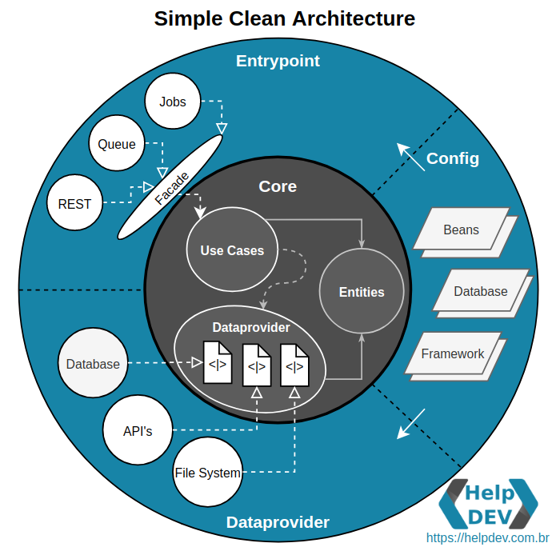

# Desafio - Oiti Java Developer

## Objetivo

O objetivo deste desafio é avaliar os seus conhecimentos em arquitetura de código, raciocínio lógico, _clean code_ e modelagem de dados.

## Etapas

## Etapa 1 - Refactoring

Por favor, baixe este repositório: queremos avaliar sua estratégia de resolução de alguns problemas contidos no projeto.

### Requisitos

- Docker
- Java JDK 11
- PostgreSql
- Idle de sua preferência

### Características do repositório

- Java 11
- Gradle
- PostgreSql

### Start do projeto

Utilize o comando abaixo para subir um container do PostgreSql:

    sudo docker network create --driver bridge postgres-network

Após a criação da rede:

    docker run --name oititec-postgres --network=postgres-network -e "POSTGRES_PASSWORD=Postgres2022!" -p 5432:5432 -v /home/$(echo $USER)/postgresql:/var/lib/postgresql/data -d postgres

Altere as configurações do Postgress no **projeto java** e o execute no Idle de sua preferência.

Pronto!

### Refactoring

- Refatorar a arquitetura do projeto aplicando **Clean Achitecture**:
  - O projeto foi desenvolvido, até então, sem seguir um padrão coeso e desacoplado. Por favor, melhore-o sobre utilizando arquitetura limpa (clean Architecture ).
- Aplicar comportamentos - **Utilize SpringBoot Beans**:
  - Adicione um filtro genérico para entradas inválidas.
  - Adicione um log genérico para todos os erros ocorridos nos fluxos.
  - Habilite o CORS da API para todos os domínios (\*).

## Etapa 2 - Live Coding

​Marcaremos com você o dia do seu _live-coding_: uma entrevista técnica onde, a partir do projeto _refatorado_ por você, lhe daremos novas instruções para conclusão da estapa 2 desafio, e deverá resolvê-lo ao vivo com um avaliador.

No início desta entrevista, **você receberá um novo documento**, contento os detalhes técnicos para a realização do desafio.

## Final

Após a avaliação, os seus resultados serão encaminhados de volta para a equipe técnica, e eles irão dar continuidade ao seu processo seletivo juntamente com o RH da Oiti.
​
